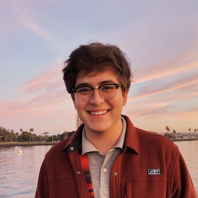

# Jonathan Zamora's User Page
## CSE 110 Lab 1: Pt. 3 - Using Markdown

---
###### [Introduction](#introduction) | [Research Interests](#research-interests) | [Research Experience](#research-experience)
###### [Upcoming Goals](#upcoming-goals) | [Favorite TV Shows and Film](#favorite-tv-shows-and-film)

### Introduction

#### Hi there! 👋🏻



My name is **Jonathan Zamora**, and I am a third-year undergraduate student at UC San Diego pursuing a **B.S. in Computer Science** 💻

### Research Interests

*During my time at UC San Diego, I have developed a deep interest in conducting computer science research.*

**_Regarding my research interests_, I am interested in:**

1. Computer Vision 💻  👓
2. Robotics 🤖
3. Reinforcement Learning 🦾
4. Deep Learning 🧠

***A reflective note on artificial intelligence, written by famous computer scientist ~~John Cena~~ Alan Turing, says:***

> **Instead of trying to produce a programme to simulate the adult mind, why not rather try to produce one which simulates the child's? If this were then subjected to an appropriate course of education one would obtain the adult brain.** - *Computing Machinery and Intelligence*, *Alan Turing*


When writing programs for my research in computer vision and deep learning, you'll often see me write the following lines of code at the top of my `Python` files:

```
import tensorflow as tf
import pytorch
import numpy as np
import matplotlib.pyplot as plt
import pandas as pd
import cv2
```

When I want to train a Machine Learning Model, i'll go in the command line and type something like this: `python train.py`

Hopefully it yields good results! 🤞🏻

### Research Experience

I have conducted research with some *really* great people at UC San Diego, including: 
* [Mesirov Lab](http://mesirovlab.org) on Cancer Bioinformatics 🧬
* [Berg Lab](https://icebergnlp.github.io) on Optical Character Recognition for Historical Documents 📖 👓
* [ARCLab](https://www.ucsdarclab.com) on Surgical Robotics 🤖

I am also an ***Incoming Machine Learning Intern at USC's Summer Undergraduate Research Experience (USC SURE REU)*** at the **[INK Lab](https://inklab.usc.edu)**

### Upcoming Goals
- [x] Transfer to UC San Diego
- [x] Finish watching the Final Season of *Mr. Robot* over Spring Break
- [ ] Complete CSE Early Research Scholars Program Project
- [ ] Earn good grades for 2020-21 School Year:
  - [x] Fall Quarter 2020
  - [x] Winter Quarter 2021
  - [ ] Spring Quarter 2021
- [ ] Complete ML Research Internship at USC in Summer 2021

### Favorite TV Shows and Film

I am a **huge** fan of the show *Mr. Robot* starring Rami Malek on Prime Video


I also *really* enjoy watching *Black Mirror* on Netflix


In addition to Rami Malek, one of my favorite actors is Christian Bale (**especially** in the film *American Psycho*)


As Patrick Bateman puts it in the film:
> You like Huey Lewis and the News? - *Patrick Bateman*

If you're *really* interested, [this Business Card Scene](https://youtu.be/cISYzA36-ZY) from the film is pure comedy